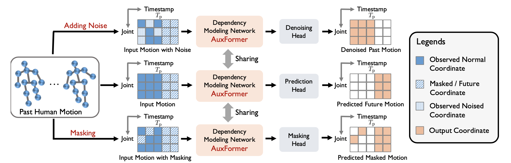

# AuxFormer

Official implementation of our paper:  
**Auxiliary Tasks Benefit 3D Skeleton-based Human Motion Prediction**  
Chenxin Xu, Robby T. Tan, Yuhong Tan, Siheng Chen, Xinchao Wang, Yanfeng Wang  
**ICCV 2023** [[paper]](https://openaccess.thecvf.com/content/ICCV2023/papers/Xu_Auxiliary_Tasks_Benefit_3D_Skeleton-based_Human_Motion_Prediction_ICCV_2023_paper.pdf)


**Abstract**: Exploring spatial-temporal dependencies from observed motions is one of the core challenges of human motion pre- diction. Previous methods mainly focus on dedicated net- work structures to model the spatial and temporal dependen- cies. This paper considers a new direction by introducing a model learning framework with auxiliary tasks. In our auxiliary tasks, partial body joints’ coordinates are corrupted by either masking or adding noise and the goal is to recover corrupted coordinates depending on the rest coor- dinates. To work with auxiliary tasks, we propose a novel auxiliary-adapted transformer, which can handle incomplete, corrupted motion data and achieve coordinate recovery via capturing spatial-temporal dependencies. Through auxil- iary tasks, the auxiliary-adapted transformer is promoted to capture more comprehensive spatial-temporal dependencies among body joints’ coordinates, leading to better feature learning. Extensive experimental results have shown that our method outperforms state-of-the-art methods by remarkable margins of 7.2%, 3.7%, and 9.4% in terms of 3D mean per joint position error (MPJPE) on the Human3.6M, CMU Mocap, and 3DPW datasets, respectively. We also demonstrate that our method is more robust under data missing cases and noisy data cases.

<div align="center">
	
</div>

## Recommand Dependencies
* Cuda 11.1
* Python 3.7
* Pytorch 1.8.0

## Data preparation
### Human3.6M
Download Human3.6M dataset from its [website](http://vision.imar.ro/human3.6m/description.php) and put the files into "data" with the dataset folder named "h3.6m".

### CMUMocap
Download CMUMocap dataset from its [website](http://mocap.cs.cmu.edu) and put the files into "data" with the dataset folder named "CMUMocap".

### 3DPW
Download 3DPW dataset from its [website](https://virtualhumans.mpi-inf.mpg.de/3DPW) and put the files into "data" with the dataset folder named "3DPW".

After the prepartion work, the data folder should have the following structure:
```
/data
├── h3.6m
    ├── dataset
        ├── S1
        ├── S5
        ├── ...
├── CMUMocap
    ├── test
    ├── train
├── 3DPW
    ├── sequenceFiles                       
```

## Train
### Human3.6M
To train a short-term motion prediction model, run
```
CUDA_VISIBLE_DEVICES={GPU_ID} python main_h36m.py --task short
```

To train a long-term motion prediction model, run
```
CUDA_VISIBLE_DEVICES={GPU_ID} python main_h36m.py --task long
```

The trained model will be saved in ckpt/ .

### CMUMocap
To train a short-term motion prediction model, run
```
CUDA_VISIBLE_DEVICES={GPU_ID} python main_cmu.py --task short
```

To train a long-term motion prediction model, run
```
CUDA_VISIBLE_DEVICES={GPU_ID} python main_cmu.py --task long
```

The trained model will be saved in ckpt/ .

### 3DPW
To train a short-term motion prediction model, run
```
CUDA_VISIBLE_DEVICES={GPU_ID} python main_3dpw.py --task short
```

To train a long-term motion prediction model, run
```
CUDA_VISIBLE_DEVICES={GPU_ID} python main_3dpw.py --task long
```

The trained model will be saved in ckpt/ .

### Evaluate
### Human3.6M
Take our trained model as an example, to evaluate a short-term motion prediction model, run
```
CUDA_VISIBLE_DEVICES={GPU_ID} python test_h36m.py --task short --model_save_name pretrain_h36m_ckpt
```

To evaluate a long-term motion prediction model, run
```
CUDA_VISIBLE_DEVICES={GPU_ID} python test_h36m.py --task long --model_save_name pretrain_h36m_ckpt_long
```

### CMUMocap
Take our trained model as an example, to evaluate a short-term motion prediction model, run
```
CUDA_VISIBLE_DEVICES={GPU_ID} python test_cmu.py --task short --model_save_name pretrain_cmu_ckpt
```

To evaluate a long-term motion prediction model, run
```
CUDA_VISIBLE_DEVICES={GPU_ID} python test_cmu.py --task long --model_save_name pretrain_cmu_ckpt_long
```

### 3DPW
Take our trained model as an example, to evaluate a short-term motion prediction model, run
```
CUDA_VISIBLE_DEVICES={GPU_ID} python test_3dpw.py --task short --model_save_name pretrain_3dpw_ckpt
```

To evaluate a long-term motion prediction model, run
```
CUDA_VISIBLE_DEVICES={GPU_ID} python test_3dpw.py --task long --model_save_name pretrain_3dpw_ckpt_long
```


## Acknowledgements
We thank for the part of the code provided by [LearnTrajDep](https://github.com/wei-mao-2019/LearnTrajDep) and [SPGSN](https://github.com/MediaBrain-SJTU/SPGSN).

## Citation
If you find our work useful in your research, please cite our paper:
```bibtex
@inproceedings{xu2023auxiliary,
  title={Auxiliary Tasks Benefit 3D Skeleton-based Human Motion Prediction},
  author={Xu, Chenxin and Tan, Robby T and Tan, Yuhong and Chen, Siheng and Wang, Xinchao and Wang, Yanfeng},
  booktitle={Proceedings of the IEEE/CVF International Conference on Computer Vision},
  pages={9509--9520},
  year={2023}
}
```


